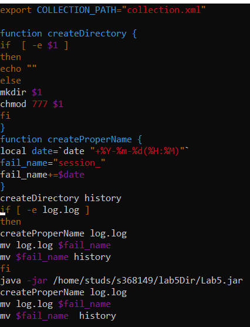

# Lab5

### <a name="1_block"/>1)

Remove empty commits

### 2)

### Description

Create new
class [FileValidator](https://github.com/danil228-emelin/Lab5/blob/main/src/main/java/itmo/p3108/util/FileValidator.java#L1-L89)
.Share responsibilities between FileValidator and CheckData.
[CheckData](https://github.com/danil228-emelin/Lab5/blob/main/src/main/java/itmo/p3108/util/CheckData.java#L1-L331)
is responsible for checking Person attributes,FileValidator for checking file attributes.Methods in CheckData aren't
static anymore.

### Result:

[Main](https://github.com/danil228-emelin/Lab5/blob/main/src/main/java/itmo/p3108/Main.java#L1-L28)

### 3)

### Description

Use FlyWeight pattern. Remove Singleton from command classes.

As can be seen,Client needs to pass argument(key)
in [FlyWeighFactory](https://github.com/danil228-emelin/Lab5/blob/main/src/main/java/itmo/p3108/command/FlyWeightCommandFactory.java#L1-L67)
in order to get command object.In this method
created command object if it didn't exist.
It is time-consuming to get and created all commands in this way.That is why I
used  [Reflections](https://github.com/danil228-emelin/Lab5/blob/main/src/main/java/itmo/p3108/util/Reflection.java#L1-L61)
to create objects.It finds all commands classes implementing interface Command directly or indirectly

### Result

Commands are not static anymore, and we have only one command instance by class ,shorten methods static.
[FlyWeightCommandFactory](https://github.com/danil228-emelin/Lab5/blob/main/src/main/java/itmo/p3108/command/FlyWeightCommandFactory.java#L1-L67)
Important to notice,commands must be created through factory.As for method findAllCommands used argument "
itmo.p3108.command"
What will happen if commands move to another package?It fails.But if we use "itmo.p3108"(root package) it recursively
checks all existing package arguments,but it will be slower.Imagine,that commands won't be moved from their package.

### 4)

Add javadoc to all classes.

### 5)

Lombok is created also constructor
For instance,[link](https://github.com/danil228-emelin/Lab5/blob/main/src/main/java/itmo/p3108/command/Add.java#L22)

### 6-7)

All problems solved.
[AnalyzeExecuteScript](https://github.com/danil228-emelin/Lab5/blob/main/src/main/java/itmo/p3108/util/AnalyzerExecuteScript.java#L18-L66)
.Also see 9)

### 8)

Created constants.
Intelij throws warnings. Suppress it.
[CheckData](https://github.com/danil228-emelin/Lab5/blob/main/src/main/java/itmo/p3108/util/CheckData.java#L23-L38)

### 9)

### Description

Validation process doesn't depend on the amount of Person Attributes.
All commands responses for checking are annotated
with [@Checking](https://github.com/danil228-emelin/Lab5/blob/main/src/main/java/itmo/p3108/util/annotation/Checking.java#L1)
Use
method [Reflections.findAllCommandsWithAnnotation](https://github.com/danil228-emelin/Lab5/blob/main/src/main/java/itmo/p3108/util/Reflection.java#L46-L58)
to find all methods responsible for validation Person
attributes.Method [CheckData.checkArguments](https://github.com/danil228-emelin/Lab5/blob/main/src/main/java/itmo/p3108/util/CheckData.java#L299-L328)
checks all argument, but it is private for serious reason: all checking methods put out messages,when attribute has
wrong
format.We don't know in which order methods will be and one case can happen: for instance,imagine that first element of
array is a name,and it has right format and the first
checking method is checkName. It doesn't provide errors.But,in second
time,method [checkName](https://github.com/danil228-emelin/Lab5/blob/main/src/main/java/itmo/p3108/util/CheckData.java#L261-L276)
can be the third.And methods before him,for example
checkHeight and checkId.They throw messages, however name has a right format.That is why
method [CheckData.wrapperCheckArguments](https://github.com/danil228-emelin/Lab5/blob/main/src/main/java/itmo/p3108/util/CheckData.java#L286-L291)
used to suppress errors output.

### Result

[AnalyzeExecuteScript](https://github.com/danil228-emelin/Lab5/blob/main/src/main/java/itmo/p3108/util/AnalyzerExecuteScript.java#L45-L62)
,
[Parser](https://github.com/danil228-emelin/Lab5/blob/main/src/main/java/itmo/p3108/parser/Parser.java#L1-L186)
become shorten.Doesn't depend on the amount of Person attributes and amount of methods which check attributes

### 10)

Change comparison with "add".
[AnalyzeExecuteScript](https://github.com/danil228-emelin/Lab5/blob/main/src/main/java/itmo/p3108/util/AnalyzerExecuteScript.java#L24-L25)

### 11)

see 8)

### 12)

see 2)

### 13)

Set path deleted.

### 14)

Remove code duplication

### 15)

see 3)

### 16)

All reasonable warnings were taken to account.

### 17)

method was useless.Remove it.

### 18)

### Result

Created more precise exception
[CommandException](https://github.com/danil228-emelin/Lab5/blob/main/src/main/java/itmo/p3108/exception/CommandException.java#L1-L8)
,[FileException](https://github.com/danil228-emelin/Lab5/blob/main/src/main/java/itmo/p3108/exception/FileException.java#L1-L12)

### 19)

### Result

All catchers inform logger about error.
Example
[link](https://github.com/danil228-emelin/Lab5/blob/main/src/main/java/itmo/p3108/parser/Parser.java#L153-L157)

### 20)

### Description

When [Reflections](https://github.com/danil228-emelin/Lab5/blob/main/src/main/java/itmo/p3108/util/Reflection.java#L1-L61)
is used we can use root package -itmo.p3108. It recursively checks all packages and finds whatever you want,but it will
take long time to traverse all hierarchy that is why I used certain package to accelarate search.

### 21)

Delete useless packages.

### 22)

see 8)

### 23)

### Description

cleaned [archetype](https://github.com/danil228-emelin/Lab5/tree/main/src/main/resources)

### 24)

Add javadoc.

### 25)

### Description

changed script,remove code duplication,created functions

